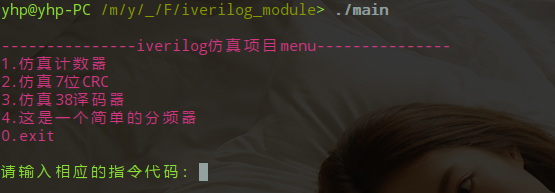
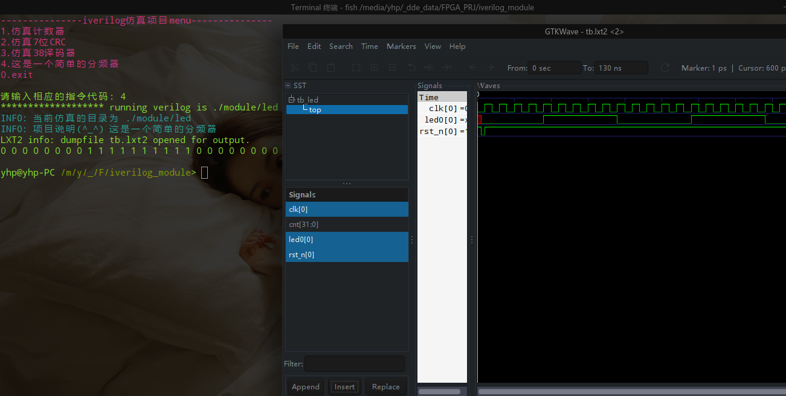
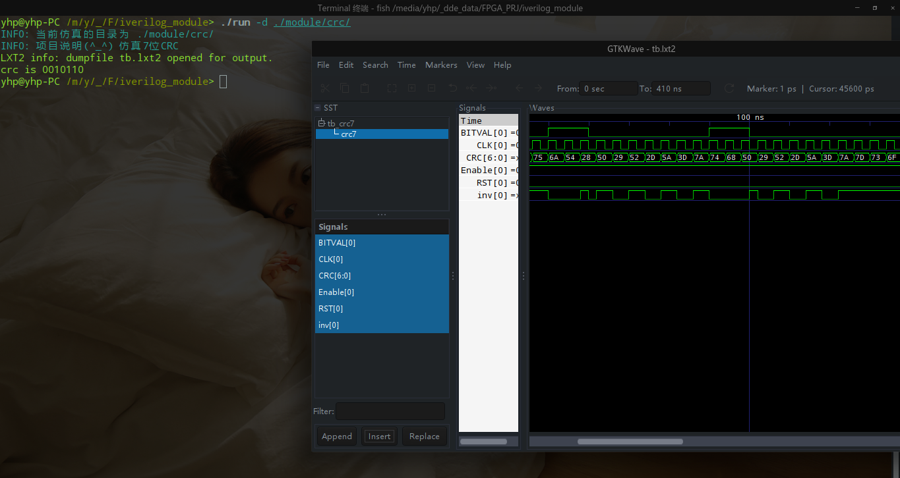
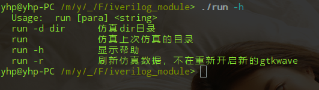
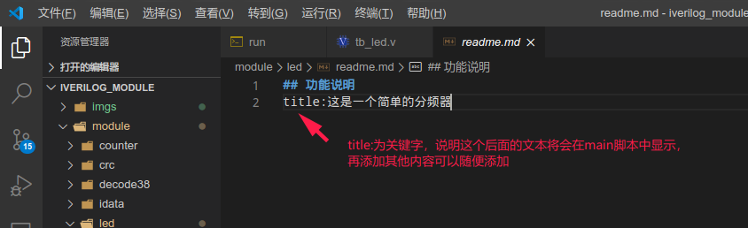
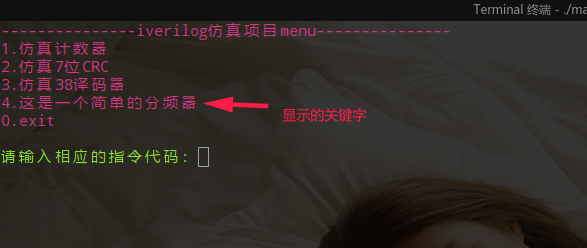
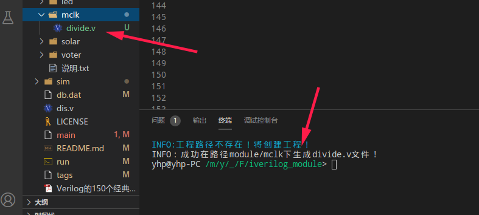
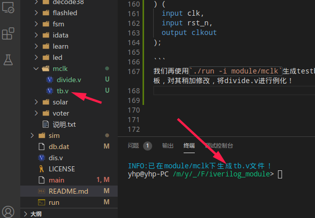
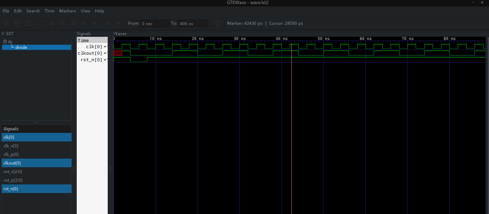

# linux下使用iverilog仿真verilog易用版本
该项目是提供一个在linux使用iverilog+gtkwave的项目模板，用于快速新建项目和仿真项目。
[没使用过的iverilog的请点击此处](https://www.kancloud.cn/dlover/fpga/1637642)
## 优势
虽然iverilog只能仿真，但是仿真速度很快，对于比较小的模块或者中型项目的验证，完全可以使用iverilog进行前期开发，以提高开发效率。
* 轻量
* 免费
* 环境配置简单
* 在本模板上易用

## 文件说明

```
.
├── db.dat 记录上次仿真项目，用于重复仿真时直接运行仿真项目
├── imgs 一些图片
│   ├── 20200415-140023.png
│   ├── 20200421-231449.png
│   ├── 20200421-232012.png
│   ├── 20200421-232053.png
│   └── 20200421-232159.png
├── LICENSE
├── main 提供仿真项目引导的shell脚本
├── module 所有仿真项目放在该路径下，一个项目一个文件夹
│   ├── counter 计数器项目
│   │   ├── counter.v
│   │   ├── readme.md
│   │   └── tb.v
│   ├── crc crc循环冗余校验项目呢
│   │   ├── CRC_7.v
│   │   ├── readme.md
│   │   └── tb_crc7.v
│   ├── decode38 38译码器项目
│   │   ├── decode38.v
│   │   ├── readme.md
│   │   └── tb_decode38.v
│   ├── idata 测试项目
│   │   ├── idata1.v
│   │   ├── idata2.v
│   │   ├── tb_idata.v
│   │   └── topdata.v
│   ├── led 简单分频器项目
│   │   ├── readme.md
│   │   ├── tb_led.v
│   │   └── top.v
│   └── 说明.txt
├── README.md
├── run 命令执行仿真指定项目
├── .shell 存放一些其他的shell脚本
│   └── test.sh
├── sim 仿真文件和结果
│   ├── ans.txt
│   ├── tb
│   ├── tb_led.v
│   ├── tb.lxt2
│   └── top.v
└── .TCL 存放一些其他tcl脚本
    ├── clk.tcl
    ├── main.tcl
    ├── verilog2tcl.tcl
    └── vfile.v


```
上面的 .TCL 和 .shell 是隐藏文件夹！
## 环境安装
在deepin或者ubuntu上，使用命令安装。

* 使用`sudo apt-get install iverilog`安装iverilog。
* 使用`sudo apt-get install gtkwave`安装波形查看工具。
* vscode选择性安装

## 使用　

* git clone  https://gitee.com/yuan_hp/iverilog_module.git
* cd iverilog_module
* ./main
* 根据提示选择需要仿真的项目





## run脚本方式使用


例如我们要仿真crc7,crc7所在路径为./module/crc ,则使用方法为
* cd iverilog_module
* 执行脚本 `./run -d ./module/crc`
* 这样项目就会开始仿真



终端输入`./run -h`显示帮助


## 格式说明
每个仿真项目可添加一个readme.md文件作为自身项目的说明，如果项目要在main脚本下显示简短功能说明则要按一下方式写。




# 修改说明
## 2020.6.4修改说明
1.添加在分项目中子文件夹下面放置verilog的文件，仿真时将会一并拷贝到sim文件夹。

2.添加隐藏除了正在调试的工程之外的所有工程，减少调试时视觉上的影响。

```
  Usage： run [para] <string>
  run -d dir      仿真dir目录
  run -i dir      在指定文件夹生成testbech模板，不存在路径则先创建路径
  run -f file     运行单.v文件分析
  run             仿真上次仿真的目录
  run -h          显示帮助
  run -r          刷新仿真数据，不在重新开启新的gtkwave
  run -hide       隐藏除了正在调试所有工程问价夹(module路径下的文件夹)
  run -unhide     显示所有隐藏的工程文件夹（module路径下的）
  ```
  没有加入环境变量时，上面的`run`用 `./run`代替。

## 2020.6.24
增加任意分频器的模板，使用方法同 生成testbech模板一样。

```bash
yhp@yhp-PC /m/y/_/F/iverilog_module> ./run -h
  Usage： run [para] <string>
  run -d dir      仿真dir目录
  run -i dir      在指定文件夹生成testbech模板，不存在路径则先创建路径
  run -f file     运行单.v文件分析
  run             仿真上次仿真的目录
  run -h          显示帮助
  run -r          刷新仿真数据，不在重新开启新的gtkwave
  run -clk dir    在指定文件夹生成任意分频器的模板divide.v，不存在路径则先创建路径
  run -hide       隐藏除了正在调试所有工程问价夹(module路径下的文件夹)
  run -unhide     显示所有隐藏的工程文件夹（module路径下的）
  ```   

例如我要在module/mclk下生成分频器，则执行`./run -clk module/mclk`,当然首先得在项目路径下！


  

生成的divide.v这个分频器文件，将会时钟输出50%占空比的波形，设置分频数N和分频器计数器位宽可以实现1-N分频。以下为其中的部分代码：

```verilog
`timescale 1ns / 1ps
// ********************************************************************
//	FileName	: divide.v
//	Author		：hpy
//	Email		：yuan_hp@qq.com
//	Date		：2020年06月18日
//	Description	：任意整数时钟分频
// --------------------------------------------------------------------
module divide#(
	parameter WIDTH = 3,  //计数器的位数，计数的最大值为 2**WIDTH-1
	parameter N  = 3  //分频系数，请确保 N < 2**WIDTH-1，否则计数会溢出
) (	
	input clk,
	input rst_n,
	output clkout
);

```
我们再使用`./run -i module/mclk`生成testbech仿真模板，对其稍加修改，将divide.v进行例化！

  


然后在 module/mclk路径下的tb.v中例化divide模块，如下：

```verilog
//生成始时钟
parameter NCLK = 4;
initial begin
        clk=0;
        forever clk=#(NCLK/2) ~clk; 
end 

/****************** BEGIN ADD module inst ******************/
//Modulenamme top (rst,clk);
divide divide(
        .clk(clk),
        .rst_n(rst)
);
/****************** BEGIN END module inst ******************/

``` 

然后执行 `./run -d module/mclk`对该项目进行仿真，并打开gtkwave查看波形！

```bash
yhp@yhp-PC /m/y/_/F/iverilog_module> ./run -d module/mclk
INFO: 当前仿真的目录为 module/mclk 
LXT2 info: dumpfile wave.lxt2 opened for output.
运行结束！

```

  

## 2020.12.1
添加了一个使用verilog实现的cpu，在module文件夹下的mini-mcu的readme.md文件有比较详细的介绍。能够实现汇编编译代码，生成带有数据的程序存储器，并自动根据使用的命令裁剪cpu。


# 项目下存在的仿真模块

```
---------------iverilog仿真项目menu---------------
1.任意bcd计数器
2.呼吸灯
3.仿真计数器
4.仿真7位CRC
5.仿真38译码器
6.led流水灯
7.序列检测状态机示例
8.这是一个简单的分频器
9.模板生成任意分频器的示例
10.自动售货机（三段式状态机）
11.三人表决器
12.FIFO实现
13.这是一个学习verilog基础语法的例子合集
14.实现一个可裁剪的处理器(mini-mcu)
15.单脉冲发生器
----------------
```  


