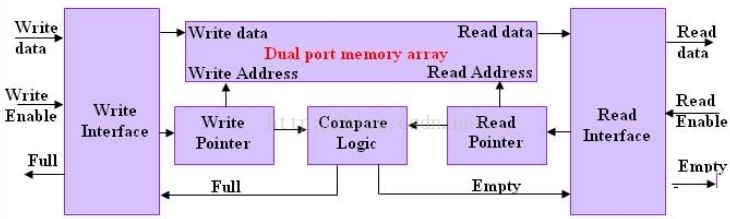
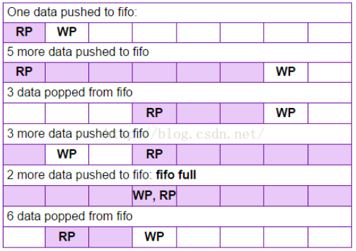
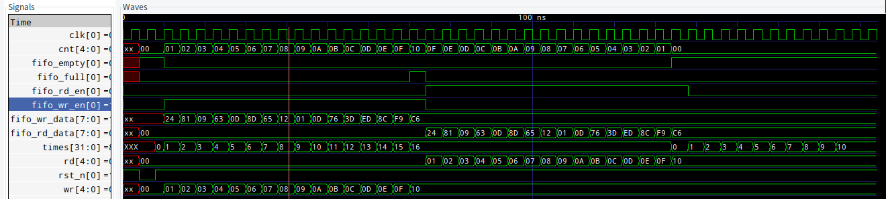

title:FIFO实现

># 简介
**FIFO**(First input First output)简单说就是指先进先出。
**FIFO的作用：**
* 增加数据传输率
* 处理大量数据流
* 匹配不同传输率的系统
* 对连续的[数据流](https://baike.baidu.com/item/%E6%95%B0%E6%8D%AE%E6%B5%81)进行缓存，防止在进机和存储操作时丢失数据
* 数据集中起来进行进机和存储，可避免频繁的总线操作，减轻CPU的负担
* 允许系统进行DMA操作，提高数据的传输速度

># 同步FIFO的实现
下面简单说明一下同步FIFO的实现，判断full和empty的方法。设置一个变量fifo_cnt记录存储器中数据个数：

  
一般FIFO使用循环指针(计数溢出自动归零)。一般可以称写指针为头head，读指针为尾tail。初始化时，读写指针指向同一数据地址。

下图可见，FIFO初始化时，WP和RP指针指向同一数据单元。WP指向下一个将要写入的数据单元，RP指向将要读出的数据单元
  

典型同步FIFO有三部分组成: （1） FIFO写控制逻辑； （2）FIFO读控制逻辑； （3）FIFO 存储实体（如Memory、Reg）。

FIFO写控制逻辑主要功能：产生FIFO写地址、写有效信号，同时产生FIFO写满、写错等状态信号；

FIFO读控制逻辑主要功能：产生FIFO读地址、读有效信号，同时产生FIFO读空、读错等状态信号。

值得注意的是，当设计的要求很高时，还需要对rd和wr的指针进行特殊的设计，保证每次地址改变时地址更改少量信号就能实现。
**简单同步FIFO**仿真结果如下：
  
