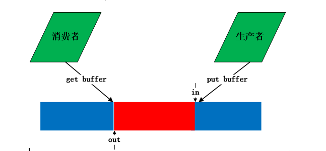

### 1. kfifo介绍

在内核中经常会有需要用到队列来传递数据的时候，而在Linux内核中就有一个轻量而且实现非常巧妙的队列实现——kfifo，kfifo可以理解为是一个环形缓冲区，缓冲区经常在文件系统中用到，通过缓冲区缓解cpu读写内存和读写磁盘的速度。例如一个进程A产生数据发给另外一个进程B，进程B需要对进程A传的数据进行处理并写入文件，如果B没有处理完，则A要延迟发送，为了保证进程A减少等待时间，可以在A和B之间采用一个缓冲区A每次将数据存放在缓冲区中，B每次冲缓冲区中取。这是典型的生产者和消费者模型，缓冲区中数据满足FIFO特性，因此可以采用队列进行实现。Linux内核的kfifo正好是一个环形队列，可以用来当作环形缓冲区。生产者与消费者使用缓冲区如下图所示：



kfifo本身并没有队列元素的概念，其内部只是一个buffer。在使用的时候需要用户知道其内部存储的内容，所以最好是用来存储定长对象。

kfifo有一个重要的特性，就是当使用场景是单生产者单消费者(1 Producer 1 Consumer，以下简称1P1C)的情况下，不需要加锁，所以在这种情况下的性能较高。

### 2. Linux kfifo


#### 2.1 数据结构

```c
struct __kfifo {
	unsigned int	in;
	unsigned int	out;
	unsigned int	mask;
	unsigned int	esize;
	void		*data;
};
```
`in`:和buffer一起构成一个循环队列。 in指向buffer中队头，out指向buffer中的队尾
`mask`:代表index掩码，FIFO块个数减1，FIFO块个数需要为2的整数次方。
`esize`:块（element）大小，FIFO按整块入队列和出队列，esize可以为1.
`data`:数据指针，可动态分配、静态分配、或用户传递数据地址。

#### 2.2 kfifo定义

```c

/**
 * kfifo_init - initialize a fifo using a preallocated buffer
 * @fifo: the fifo to assign the buffer
 * @buffer: the preallocated buffer to be used
 * @size: the size of the internal buffer, this have to be a power of 2
 *
 * This macro initializes a fifo using a preallocated buffer.
 *
 * The number of elements will be rounded-up to a power of 2.
 * Return 0 if no error, otherwise an error code.
 */
#define kfifo_init(fifo, buffer, size)

/**
 * DECLARE_KFIFO - macro to declare a fifo object
 * @fifo: name of the declared fifo
 * @type: type of the fifo elements
 * @size: the number of elements in the fifo, this must be a power of 2
 */
#define DECLARE_KFIFO(fifo, type, size)	STRUCT_KFIFO(type, size) fifo

/**
 * INIT_KFIFO - Initialize a fifo declared by DECLARE_KFIFO
 * @fifo: name of the declared fifo datatype
 */
#define INIT_KFIFO(fifo) \
(void)({ \
	typeof(&(fifo)) __tmp = &(fifo); \
	struct __kfifo *__kfifo = &__tmp->kfifo; \
	__kfifo->in = 0; \
	__kfifo->out = 0; \
	__kfifo->mask = __is_kfifo_ptr(__tmp) ? 0 : ARRAY_SIZE(__tmp->buf) - 1;\
	__kfifo->esize = sizeof(*__tmp->buf); \
	__kfifo->data = __is_kfifo_ptr(__tmp) ?  NULL : __tmp->buf; \
})

/**
 * kfifo_peek - get data from the fifo without removing
 * @fifo: address of the fifo to be used
 * @val: address where to store the data
 *
 * This reads the data from the fifo without removing it from the fifo.
 * It returns 0 if the fifo was empty. Otherwise it returns the number
 * processed elements.
 *
 * Note that with only one concurrent reader and one concurrent
 * writer, you don't need extra locking to use these macro.
 */
#define	kfifo_peek(fifo, val)

/**
 * kfifo_in - put data into the fifo
 * @fifo: address of the fifo to be used
 * @buf: the data to be added
 * @n: number of elements to be added
 *
 * This macro copies the given buffer into the fifo and returns the
 * number of copied elements.
 *
 * Note that with only one concurrent reader and one concurrent
 * writer, you don't need extra locking to use these macro.
 */
#define	kfifo_in(fifo, buf, n)


/**
 * kfifo_in_spinlocked - put data into the fifo using a spinlock for locking
 * @fifo: address of the fifo to be used
 * @buf: the data to be added
 * @n: number of elements to be added
 * @lock: pointer to the spinlock to use for locking
 *
 * This macro copies the given values buffer into the fifo and returns the
 * number of copied elements.
 */
#define	kfifo_in_spinlocked(fifo, buf, n, lock)

/**
 * kfifo_in_spinlocked_noirqsave - put data into fifo using a spinlock for
 * locking, don't disable interrupts
 * @fifo: address of the fifo to be used
 * @buf: the data to be added
 * @n: number of elements to be added
 * @lock: pointer to the spinlock to use for locking
 *
 * This is a variant of kfifo_in_spinlocked() but uses spin_lock/unlock()
 * for locking and doesn't disable interrupts.
 */
#define kfifo_in_spinlocked_noirqsave(fifo, buf, n, lock)


/**
 * kfifo_out - get data from the fifo
 * @fifo: address of the fifo to be used
 * @buf: pointer to the storage buffer
 * @n: max. number of elements to get
 *
 * This macro get some data from the fifo and return the numbers of elements
 * copied.
 *
 * Note that with only one concurrent reader and one concurrent
 * writer, you don't need extra locking to use these macro.
 */
#define	kfifo_out(fifo, buf, n)


/**
 * kfifo_out_spinlocked - get data from the fifo using a spinlock for locking
 * @fifo: address of the fifo to be used
 * @buf: pointer to the storage buffer
 * @n: max. number of elements to get
 * @lock: pointer to the spinlock to use for locking
 *
 * This macro get the data from the fifo and return the numbers of elements
 * copied.
 */
#define	kfifo_out_spinlocked(fifo, buf, n, lock)

/**
 * kfifo_from_user - puts some data from user space into the fifo
 * @fifo: address of the fifo to be used
 * @from: pointer to the data to be added
 * @len: the length of the data to be added
 * @copied: pointer to output variable to store the number of copied bytes
 *
 * This macro copies at most @len bytes from the @from into the
 * fifo, depending of the available space and returns -EFAULT/0.
 *
 * Note that with only one concurrent reader and one concurrent
 * writer, you don't need extra locking to use these macro.
 */
#define	kfifo_from_user(fifo, from, len, copied)


/**
 * kfifo_to_user - copies data from the fifo into user space
 * @fifo: address of the fifo to be used
 * @to: where the data must be copied
 * @len: the size of the destination buffer
 * @copied: pointer to output variable to store the number of copied bytes
 *
 * This macro copies at most @len bytes from the fifo into the
 * @to buffer and returns -EFAULT/0.
 *
 * Note that with only one concurrent reader and one concurrent
 * writer, you don't need extra locking to use these macro.
 */
#define	kfifo_to_user(fifo, to, len, copied)

/**
 * kfifo_out_peek - gets some data from the fifo
 * @fifo: address of the fifo to be used
 * @buf: pointer to the storage buffer
 * @n: max. number of elements to get
 *
 * This macro get the data from the fifo and return the numbers of elements
 * copied. The data is not removed from the fifo.
 *
 * Note that with only one concurrent reader and one concurrent
 * writer, you don't need extra locking to use these macro.
 */
#define	kfifo_out_peek(fifo, buf, n)
```

`kfifo_init()`:初始化kfifo，使用预先分配的buffer size，声明则使用`struct kfifo kfifo_test`

`DECLARE_KFIFO`:声明kfifo，初始化则使用`INIT_KFIFO`进行初始化。

`kfifo_in`:写入字符串或者其他数据到fifo

`kfifo_put`:写入value到fifo

`kfifo_out`:从fifo取出指定size的数据，取出之后会移除

`kfifo_peek`:只查询数据，不会删除

`kfifo_get`:从fifo里面拿数据出来，只拿不会移除，如果fifo是空，就会返回0，不是空则返回

`kfifo_skip`:跳过第一个元素

`kfifo_from_user`:跟copy_from_user类似

`kfifo_to_user`:跟copy_to_user类似


### 3. 接口
|   |    |
|---|----|
DECLARE_KFIFO_PTR(fifo, type)|	|定义一个非record FIFO，名字为fifo，element类型为type，其数据需要动态分配。
DECLARE_KFIFO(fifo, type, size)|	定义一个非record FIFO，名字为fifo，element类型为type，element个数为size，其数据静态存储在结构体中，size需为常数且为2的整数次方
INIT_KFIFO(fifo)|	初始化DECLARE_KFIFO接口定义的fifo
DEFINE_KFIFO(fifo, type, size)|	定义并初始化fifo
kfifo_initialized(fifo)|	fifo是否初始化
kfifo_esize(fifo)	|返回fifo的esize
kfifo_recsize(fifo)|	返回fifo的recsize
kfifo_size(fifo)|	返回fifo的size
kfifo_reset(fifo)	|将in和out置0，注意：需要上锁。
kfifo_reset_out(fifo)	|将out设置为in，由于只修改out，因此在读者上下文，且只有一个读者时，是安全的。否则需要上锁。
kfifo_len(fifo)	|返回fifo中element的个数
kfifo_is_empty(fifo)|	fifo是否为空 (in == out)
kfifo_is_full(fifo)	|fifo是否满
kfifo_avail(fifo)	|非record FIFO，返回可容纳的element个数
record FIFO，返回除去record头能容纳的字节数，最多不超过record头能表示的字节数，如recsize为1，最多返回255。
kfifo_skip(fifo)|	跳过一个element或record
kfifo_peek_len(fifo)	|获取下一个element或者record的字节长度。
kfifo_alloc(fifo, size, gfp_mask)	|为指针式FIFO分配空间并初始化，成功返回0，错误则返回负数错误码
kfifo_free(fifo)|	释放kfifo_alloc分配的内存
kfifo_init(fifo, buffer, size)|使用预分配的缓存初始化fifo，成功返回0，错误则返回负数错误码
kfifo_put(fifo, val)|	这是一个宏，将val赋值给一个FIFO type类型的临时变量，然后将临时变量入队。存放一个element，如果成功返回入队的elements个数。如果FIFO满，则返回0。
kfifo_get(fifo, val)	|val是一个指针，内部将val赋值给一个ptr指针类型的临时变量，并拷贝sizeof(*ptr)长度到val的地址。对于record FIFO，其是void类型，sizeof(void)为1，所以拷贝1个字节。非record类型，拷贝一个element。
如果FIFO为空，返回0，否则返回拷贝的element数。
kfifo_peek(fifo, val)|	和kfifo_get相同，除了不更新out外。
kfifo_in(fifo, but, n)|	入队n个elemnts。返回工程入队的elements数。
kfifo_in(fifo, buf, n, lock)|	加锁入队。加锁方式为spin_lock_irqsave
kfifo_out(fifo, buf, n)	|出队n个elements，返回成功拷贝的elements数
kfifo_out_spinlocked(fifo, buf, n, lock)|	加锁出队。加锁方式位spin_lock_irqsave
kfifo_from_user(fifo, from, len, copied)	|最多拷贝len个字节，参考record FIFO和非record FIFO的对应底层接口。
kfifo_to_user(fifo, to, len, copied)|	最多拷贝len个字节到用户空间，参考record FIFO和非record FIFO的对应底层接口。
kfifo_dma_in_prepare
kfifo_dma_in_finish
kfifo_dma_out_prepare
kfifo_dma_out_finish	DMA接口，略
kfifo_out_peek(fifo, buf, n)	|peek n个elements的数据，但是内部out不动，返回拷贝的elements个数


### Referece
[](https://blog.csdn.net/u011298001/article/details/86063987)